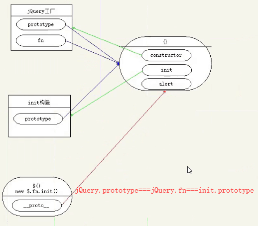

# jQuery
实现自己的一个jQuery ，

## 基础知识

[1.需要具备的基础知识>>>](./base/README.md)

	
### 实列成员，静态成员
jQ的静态成员 $.ajax

###  jQuery 对象是不是伪数组？
 也是伪数组

###  jQuery 创建伪数组对象的原理
	// 工厂模式
	function $(){
		return new init()
	}
	// 构造函数
	function init(){
		//this.length = 4;
		//this[0] = 'abc';
		//this[1] = 'abc';
		//this[2] = 'abc';

		//方法的借用，相当于上面代码的简写
		[].push.call(this,'aaa','bbb','ccc','ddd')
	}
	
	//$() 得到的是实列对象，也是一个伪数组
	console.log($().length)

### jQ 整体结构
	整体结构一3.x版本
	// 整体是一个自调用函数，沙箱模式
	(function(global,factory){
		factory()

	})(window,function(){
		//jQ 的主体代码在这里
	});

	// 为什么传window，提高变量访问效率，变量访问规则，先访问局部变量，

	//1.7 版本
	//1. 整体是一个自调用函数，沙箱模式
	(function(window){
    	var
		version = "3.4.1",

		// 3.$的函数体是一个工厂模式
		jQuery = function( selector, context ) {

         // jQuery.fn是jQuery 原型的简称。
        //  jQuery.fn.init 是一个构造函数
			return new jQuery.fn.init( selector, context );
    	};
    
   	 	//4. fn 是jQuery 原型的简称。
    	jQuery.fn = jQuery.prototype = {
        	constructor:jQuery
    	};
	
    	//5.在原型上定义构造函数
    	var init = jQuery.fn.init = function(){

    	}

	 // 6.把构造函数的原型替换为工厂的原型，为的是让实例能够访问$.fn 上的成员,
    	// 为了实现插件机制
    	init.prototype = jQuery.fn;
    // 对外暴露$
    	window.jQuery = window.$ = jQuery;
	})(window);

splice  拼接  index  howmany   item1, ..., itemX

### arrayObject.slice(start,end)    slice() 方法可从已有的数组中返回选定的元素。

### arrayObject.splice(index,howmany,item1,.....,itemX)   然后返回被删除的项目

  var obj = {}

  [].push.call(obj,1)
  log(obj)

  obj.push = [].push;

  obj.push(10)

  log(obj)